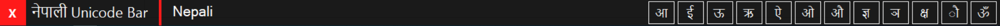

# Date-Bar-Unicode

Just a Date Bar in Unicode. It Gets to vision only when NP language selected. Made generally for personal use as आ , ई , ऊ, ऐ, ओ, औ etc. are not present on keyboard and using अा is not accepted for general and professional uses.

Thank YOU!!

